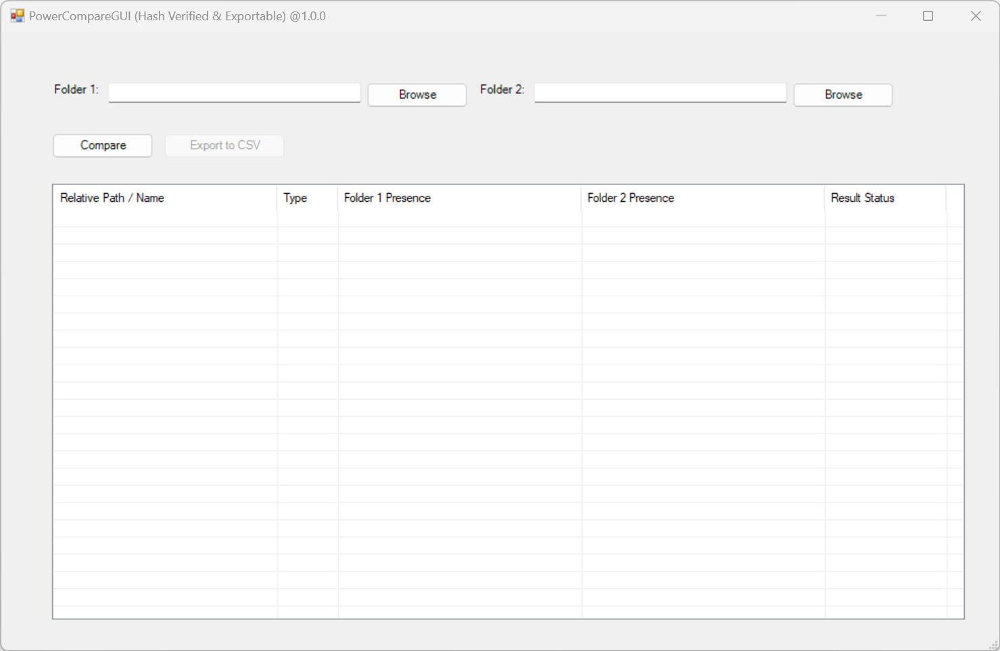

# PowerCompareGUI 📁🔍

[](https://www.microsoft.com/windows)
[](https://dotnet.microsoft.com/en-us/dotnet/framework)
[](https://github.com/PowerShell/PowerShell)
[](https://opensource.org/licenses/MIT)

## 📝 Description

**PowerCompareGUI** is a lightweight, native Windows PowerShell tool that provides a visual interface for comparing two directories selected by user. Unlike basic file-name comparators, it performs deep **SHA-256 content hashing** to verify true file integrity. It features a color-coded results dashboard and allows you to export detailed comparison reports to CSV.

## ✨ Features

- 🖥️ **Native GUI**: Clean, modern Windows Forms interface (no external dependencies required).
- 🔐 **Hash Verification**: Uses SHA-256 to compare actual file contents, not just names or sizes.
- 🎨 **Color-Coded Results**: Instantly identify differences with visual row highlighting:
  - 🔴 **Red**: Files/Folders present *only* in Folder 1.
  - 🟢 **Green**: Files/Folders present *only* in Folder 2.
  - 🟡 **Yellow**: Files present in both, but **modified** (hash mismatch).
  - ⚪ **Gray**: **Identical** matches (verified by hash).
- 📊 **CSV Export**: Generate and save comprehensive comparison reports for auditing.
- 🔄 **Recursive Scanning**: Compares all subdirectories and nested files automatically.

---

## ⚙️ Requirements

**Built-in Windows Components (No Installation Needed):**

- **Operating System**: Windows 10 / 11 / Server (Requires Windows Forms support).
- **PowerShell**: PowerShell 5.1+ (Built into Windows) or PowerShell Core 7+ (Windows environment).
- **.NET Framework**: 4.5 or higher (Built into Windows) for native Windows Forms rendering.
- **Dependencies**: None. Uses native .NET assemblies (`System.Windows.Forms`, `System.Drawing`).

---

## 💻 How to Use Powershell script (User Steps)

**Step 1: Download the Script**
Clone the repository or download the `PowerCompare.ps1` file directly to your local machine.

```bash
git clone https://github.com/soyuiz11/PowerCompareGUI.git
```

**Step 2: Run the Script**
Open PowerShell (Press Win + R on your keyboard), navigate to the script's location using `cd`, and execute `PowerCompareGUI.ps1`. *(Note: If you encounter execution policy restrictions, bypass them for the current session).*

```powershell
# Change directory to PowerCompareGUI where script is located:
cd PowerCompareGUI

# Run the script:
.\PowerCompareGUI.ps1

# If needed, allow script execution for the current session:
Set-ExecutionPolicy -Scope Process -ExecutionPolicy Bypass
```

Upon a successful launch you can see the following **PowerCompareGUI** window.



**Step 3: Compare Folders**

- Click **Browse** next to *Folder 1* and select your source directory.
- Click **Browse** next to *Folder 2* and select your target directory.
- Click the **Compare** button to initiate the scan.

**Step 4: Review & Export**

- Review the color-coded `ListView` to spot missing or modified files.
- Click **Export to CSV** to save the structured results to your local machine.

---

## 🛠️ Script Logic (How It Works)

The script executes in the following sequential steps based on its architecture:

1. **Environment Initialization**: Loads `.NET` Windows Forms and Drawing assemblies to build the native GUI without requiring external modules.
2. **UI Construction**: Dynamically generates the Form, input fields, directory browsers, and the results `ListView` with predefined columns.
3. **Directory Inventory (`Get-FolderInventory`)**: Recursively scans both target folders using `Get-ChildItem`. For every file, it calculates a `SHA256` hash via `Get-FileHash` to create a unique content fingerprint.
4. **Comparison Engine**: Merges the relative paths from both inventories. It evaluates each path to determine if it's missing, present in both, or modified (by comparing the SHA256 hashes).
5. **Visual Rendering**: Maps the comparison results to the `ListView`, applying specific background colors (Red, Green, Yellow, Gray) to highlight the status of each file/folder.
6. **Export Pipeline**: Captures the in-memory results array (`$script:comparisonResults`) and pipes it to `Export-Csv` when the user triggers the save dialog.

---

## 🚀How to Install `.exe` (Windows executable file)

To run the compiled executable from anywhere in ***Windows Command Prompt*** `cmd` or ***PowerShell***  using its short command name, follow these steps to add it to your system path:

### Step 1: Download the Executable

1. Go to the [Releases](../../releases) page.

2. Download the latest compiled version of the `.exe` file.
   
   **Note:** Because this executable is unsigned, Windows Defender SmartScreen or your browser may show a warning when downloading. You can safely click "Run anyway".

### Step 2: Move downloaded file `pcomp.exe` to a Dedicated Folder

To store your custom command-line tools like this `pcomp.exe` create a dedicated folder on your computer (for example: `C:\bin`). Move the downloaded file into this folder.

### Step 3: Add folder to the PATH on Windows machine

To call `pcomp.exe` from any directory, add your folder to the Windows Environment Variables:

#### Option A (Fastest): via PowerShell

Open PowerShell **as Administrator** and run the following command (replace `C:\bin` with your actual folder path):

```powershell
[Environment]::SetEnvironmentVariable("Path", $env:Path + ";C:\bin", "User")
```

*Note: Restart any open terminal windows for the changes to take effect.*

#### Option B: via Windows GUI

1. Press the **Windows Key**, type `env`, and select **Edit the system environment variables**.
2. Click the **Environment Variables...** button at the bottom right.
3. Under *User variables*, select **Path** and click **Edit...**.
4. Click **New**, paste the absolute path to your folder (e.g., `C:\bin`), and click **OK** on all windows.

### Step 4: Verify Installation

Open a Command Prompt (Press Win + R to open the Run dialog), type `cmd` for command-line shell (or `powershell`) and simply type your executable name to launch it:

```cmd
pcomp
```

### ➡️Verify File Integrity (Optional)

To verify that your downloaded binary has not been modified or corrupted, you can check its SHA-256 hash string against hash in file `pcomp.exe.sha256` from the [Releases](../../releases) page.

Open PowerShell and run:

```powershell
Get-FileHash .\pcomp.exe
```

The resulting hash string should exactly match official release signature.

## 💡Troubleshooting: Windows SmartScreen Warning

Because this executable is an independent, open-source tool and is not signed with a commercial certificate, Windows SmartScreen may display a blue warning box saying **"Windows protected your PC"** when you run it for the first time.

*How to run the tool safely*:

1. In the SmartScreen window, click on the **"More info"** link text.
2. Verify that the app matches the name you downloaded.
3. Click the **"Run anyway"** button that appears at the bottom.

## 📄 License

This project is open-source and released under the **MIT License**. 

<details>
<summary><b>Click to view MIT License Text</b></summary>

MIT License

Copyright (c) 2026 soyuiz

Permission is hereby granted, free of charge, to any person obtaining a copy
of this software and associated documentation files (the "Software"), to deal
in the Software without restriction, including without limitation the rights
to use, copy, modify, merge, publish, distribute, sublicense, and/or sell
copies of the Software, and to permit persons to whom the Software is
furnished to do so, subject to the following conditions:

The above copyright notice and this permission notice shall be included in all
copies or substantial portions of the Software.

THE SOFTWARE IS PROVIDED "AS IS", WITHOUT WARRANTY OF ANY KIND, EXPRESS OR
IMPLIED, INCLUDING BUT NOT LIMITED TO THE WARRANTIES OF MERCHANTABILITY,
FITNESS FOR A PARTICULAR PURPOSE AND NONINFRINGEMENT. IN NO EVENT SHALL THE
AUTHORS OR COPYRIGHT HOLDERS BE LIABLE FOR ANY CLAIM, DAMAGES OR OTHER
LIABILITY, WHETHER IN AN ACTION OF CONTRACT, TORT OR OTHERWISE, ARISING FROM,
OUT OF OR IN CONNECTION WITH THE SOFTWARE OR THE USE OR OTHER DEALINGS IN THE
SOFTWARE.

</details>

## 🏆Credits

This project utilizes or was inspired by the following open-source software:

- [PowerCompare](https://github.com/AlexIn-Tech/PowerCompare) — Licensed under the [MIT License](https://github.com).

## ✍️ Author

**soyuiz** — [gesoyuiz@gmail.com](mailto:gesoyuiz@gmail.com)